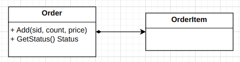
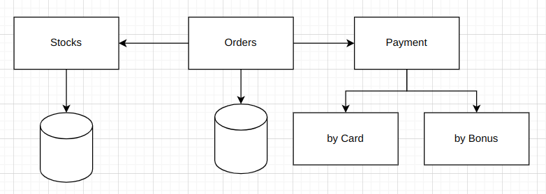
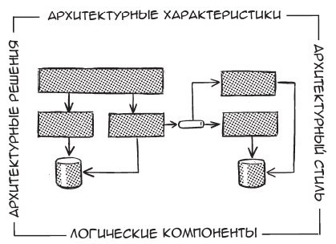

# Архитектура ПО без мистики

## Архитектура и дизайн

Архитектура VS дизайн - разные вещи.

План строительства программной системы.
Архитектура связана со структурой программы.

Строительство
- архитектура - **структура**, чертеж, план строительства, размеры комнат, этажность
- дизайн - **внешний вид**, где стоять будет кровать, тип напольного покрытия, цвет стен

Дизайн
- UML диаграмма классов и их связей
- 

Архитектура
- сервисы, базы данных, их связь между собой
- 

Не всегда можно четко отнести решения к архитектуре или дизайну. Это континуум, спектр.

Архитектура VS дизайн, когда что:
- решения стратегические и тактические (затраченное время, кол-во интересантов, долгосрочность)
- усилия большие и малые
- компромиссы значимые и незначительные

> Архитектура ПО это то что трудно изменить. 
> (Мартин Фаулер)

## Архитектура



1. архитектурные характеристики(возможности, нефункциональные требования, атрибуты качества): 
   - безопасность
   - масштабируемость
   - тестируемость
   - доступность (99.999%)
   - произвольность
   - ...
2. архитектурные решения: тип БД, сервисы, способ взаимодействия...
3. логические компоненты, функциональные блоки: управление платежами, запасами...
4. архитектурный стиль
   - микросервисы
   - многоуровневой
   - событийно-ориентированный
   - монолитный
   - ?

## Архитектурные характеристики (нефункциональные требования)

Разрабатывая архитектуру, сначала определите ключевые возможности приложения.

Архитектурные характеристики — критической важные для успешной работы.

Арх. характеристики же синоним для: возможности, нефункциональные требования, атрибуты качества.

## Архитектурные решения

Собственно само решение - что мы буде делать, как это будет выглядеть. 
Например, если это дом, то сколько этажей, тип перекрытий.

Для ПО это может быть
- решение разделение на front and backend
- отделение GUI от способа хранения данных
-  

## Логические компоненты

В строительстве компонентом может быть помещение. Здание состоит из этажй, а этаж из помещений.

Квадратики на схеме - отчасти являются логическими компонентами. Например
- обработка платежей
- обработка заказов
- работа с резервами товаров
- управление бронированием

```plantuml
class Stocks
class Orders
class Payment
class Delivery
class Observe

Stocks <- Orders
Orders -> Payment
Orders --> Delivery
Orders --> Observe
```

Логические компоненты не связаны с конкретными технологиями, языками программирования и т.п.

**Предметная область** - отвечает на вопрос ЧТО. То есть является задачей.
**Функциональность** - отвечает на вопрос КАК. То есть является решением.

## Архитектурный стиль

Под требования нужно уметь подобрать архитектурный стиль. У каждого стиля есть свои преимущества и недостатки.

Примеры
- монолит
- микросервисы
- событийно-ориентирование
- микроядро
- многоуровневая