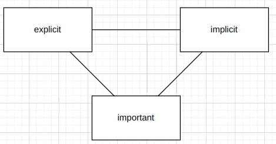

# Архитектурные характеристики (нефункциональные требования)

Архитектурные характеристики не связанны с предметной областью, с тем что делает ПО (функциональные требования).
Однако они могут влиять друг на друга, например
- решение хранить персональные данные клиентов в сервисе повлечет изменение нефункционального требования "безопасность"
- решение поддерживать "юзабельность" может повлиять на смену фреймворка в сервисе

Часто нефункциональные требования имеют форму прилагательного оканчивающегося на "-ость"

Примеры
- масштабируемость
- надежность
- тестируемость
- безопасность
- юзабельность
- расширяемость
- доступность
- производительность
- интернационализация
- интегрируемость

Далеко не все требования стоит воплощать в ПО, только самые критичные. 
Так как это может резко усложнить само приложение.

Некоторые **требования связаны между собой**, например:
- улучшение безопасности может снизить юзабельность или производительность

Выбирать архитектурный стиль следует в последнюю очередь, после анализа всех исходных данных.

Инкрементальный подход для нефункциональных требования малопригоден.
Например, сложно сделать систему масштабируемой, если изначально этого не предусмотрели.

**Аспекты** нефункциональных требований
- **явные** (надежность, масштабируемость и т.п.)
- **неявные** (скрытыие, отражаются на структуре ПО, например, выбор между монолитом и микросервисами)
- **критичность** (только важные требования, не все возможные)

Связь между требованиями и характеристиками:
- **Требования** - что должно делать приложение
    - приложение должно дать возможность клиентам общаться друг с другом текстовыми сообщениями в общих чатах
- **Характеристика** - влияют на способ реализации требований
  - в приложении могут общаться милилоны пользователей (против сотен)
  - чат должен поддерживать тысячи пользователей (против десятка)

Международный стандарт на список требований по группам https://iso25000.com/index.php/en/iso-25000-standards/iso-25010?start=5
Однако, единого списка не существует.

| Технологические  | Структурные      | Эксплуатационные          | Сквозные           |
|------------------|------------------|---------------------------|--------------------|
| модульность      | защищенность     | доступность               | законность         |  
| тестируемость    | сопровоздаемость | восстанавливаемость       | защищенность       |
| гибкость         | переносимость    | устойчивость              | конфиденциальность |
| развертываемость | локализация      | производительность        | юзабельность       |
| расширяемость    | расширяемость    | надежность / безопасность | доступность        |
| разделимость     |                  | масштабируемость          |                    |

Откуда брать нефункциональные требования
- поставленная задача по предметной области
- окружение (стартап или корпорация)
- целостное понимание предметной области

Составная характеристика - (требование) состоящие из двух и более "атомарных" требований. 
Обычно, атомарные требования можно измерить, а составные нужно разбить на атомарные. Например
- надежность = доступность + масштабируемость

Архитектор должне понимать, как расшифровать требования заказчика

| Заказчик                                               | Требования                                                |
|--------------------------------------------------------|-----------------------------------------------------------|
| ПО должно изменятся под требования рынка               | гибкость, модульность, расширяемость                      |
| заявки должны быть обработаны до вечера                | производительность, масштабируемость, восстанавливаемость |
| предполагается активная интеграция с другими системами | совместимость, интегрируемость                            |
| жесткие временные рамки, малый бюджет                  | осуществимость, простота, экономичтность                  |

Логические компоненты - структура и **поведение**.
Архитектурные характеристики - это **возможности**.

Отобрать не более 7и нефункциональных требований (5+2).

