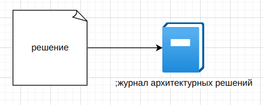
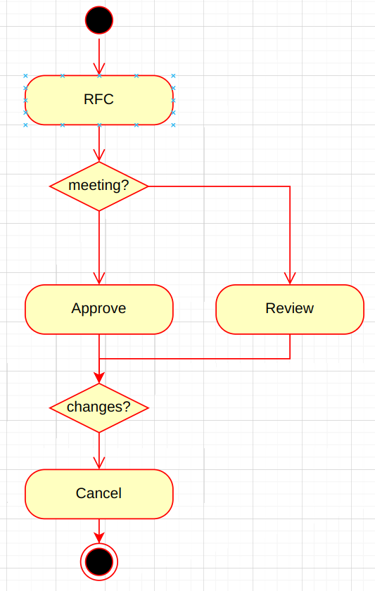

# Два закона архитектуры ПО

Архитектура ПО это набор компромиссов. Невозможно удовлетворить все требования. 
Поэтому нужно выбрать только 7 (максимум) главых характеристик архитектуры (нефункциональных требований).

Архитектура не статична, она развивается под новые требования.

Законы
- все основано на КОМПРОМИССАХ (нет лучших практик)
- ПОЧЕМУ намного важнее КАК (документирование причин принятия решений)

У каждого решения есть достоинства и недостатки.

Например

|        | синхронное                                                   | асинхронное                                            |
|--------|--------------------------------------------------------------|--------------------------------------------------------|
| плюсы  | простота, прозрачность, транзакции,                          | масштабируемость, отказоустойчивость, низкая связность |
| минусы | зависимость от доступности, высокая связность, расширяемость | сложность                                              |

Журнал архитектурных решений состоит из набора записей о решениях.

ADR - architecture decision record.

Каждое решение может содержать
- заголовок
  - номер
  - краткое название
  - пример: 001 хранить результаты в json в файле журнала
- статус
  - стадия принятия решения: обсуждение, предложено, принято, отменено
  - статус ОТМЕНЕН должен ссылаться на другое решение, которые замещает текущее
- контекст
  - описывает ситуацию в которой принимается решение
  - отвечает на вопрос ПОЧЕМУ сделан этот выбор 
  - факторы, которые способствовали принятияю решения
  - технологические нюансы
  - административные, политические аспекты
- решение
  - описание самого решение и что оно дает
  - описание обоснования принятого решения
- последствия
  - плюсы и минусы решения
- управление
  - как будет исполняться это решение
- примечание
  - автор
  - дата одообрения
  - кем одобрен
  - даты отмены
  - дата последнего изменения
  - кеи изменен
  - ...

Оценка **последствий**
- на кого и на что влияет это решение?
- усложняет ли тестирование?
- как понять, что решение реализовано?
- вводит ли новую инфраструктуру или наоборт упрощает?
- затрагивает ли решение нефункциональные требования?
- какие расходы связаны с решением?
- появляются ли новые ограничения?

Плюсы ADR
- документирование решений
- ответы на вопросы когда и почему решение было принято
- возможность в будуем не наступать на те же грабли
- ответы на вопросы даже в отсутствии специалиста, которы мог бы подсказать

Пример

| Пункт       | Содержание                                                                                                            |
|-------------|-----------------------------------------------------------------------------------------------------------------------|
| название    | 001 использование очередней сообщений для взаимодействия между сервисами                                              |
| статус      | принято                                                                                                               |
| контекст    | сервис должен уведомлять другие сервисы об событиях происходящих с ним                                                |   
| решение     | использование очередй сообщений, будет проще подключать новых клиентов, использование outbox pattern усложнит сервисы |
| последствия | поддержка брокера сообщений, обучение работы с очередями                                                              |
| управление  |                                                                                                                       |
| примечание  |                                                                                                                       |
