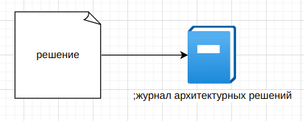
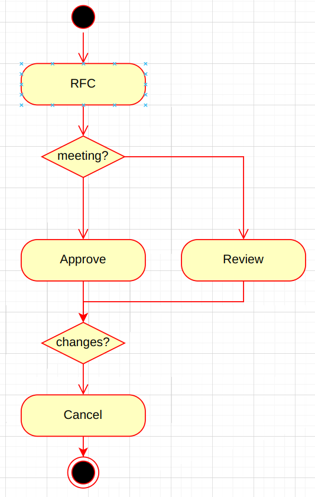

# Два закона архитектуры ПО

Архитектура ПО это набор компромиссов. Невозможно удовлетворить все требования. 
Поэтому нужно выбрать только 7 (максимум) главых характеристик архитектуры (нефункциональных требований).

Законы
- все основано на КОМПРОМИССАХ (нет лучших практик)
- ПОЧЕМУ намного важнее КАК (документирование причин принятия решений)

У каждого решения есть достоинства и недостатки.

Например

|        | синхронное                                    | асинхронное                                            |
|--------|-----------------------------------------------|--------------------------------------------------------|
| плюсы  | простота, прозрачность                        | масштабируемость, отказоустойчивость, низкая связность |
| минусы | зависимость от доступности, высокая связность | сложность                                              |

Журнал архитектурных решений состоит из набора записей о решениях.

Каждое решение может содержать
- заголовок
  - номер
  - краткое название
  - пример: 001 хранить результаты в json в файле журнала
- дата
- статус
  - стадия принятия решения: обсуждение, предложено, принято, отменено
  - статус ОТМЕНЕН должен ссылаться на другое решение, которые замещает текущее
- контекст
  - описывает ситуацию в которой принимается решение
  - отвечает на вопрос ПОЧЕМУ сделан этот выбор 
  - факторы, которые способствовали принятияю решения
  - технологические нюансы
  - административные, политические аспекты
- решение
  - описание самого решение и что оно дает
  - описание обоснования принятого решения
- последствия
- управение
- примечание

