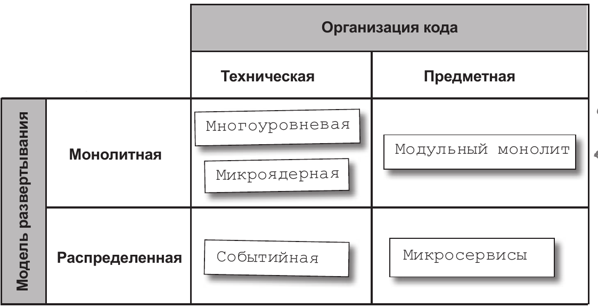

# Архитектурные стили

Способы классификации архитектурных стилей

Модель развертывания
- монолитная
- модульная

Организация кода
- техническая
- предметная

Диаграмма сравнения

## Организация кода

Техническая по слоям
- контроллеры
- модель
- представление
- сервисы

Предметная
- клиент
- заказ
- оплата
- доставка

## Модель развертывания

Монолитная модель
- плюсы
  - простота наблюдения и анализа 
  - развертывается как единое приложение
  - вызовы между компонентами идут внутри процесса
  - ниже стоимость эксплуатации и разработки
  - проще отладку проводить
- минусы
  - развертываем ость требуется целиком, даже если изменения небольшие
  - хуже масштабируется
  - надежность, любая ошибка затрагивает весь монолит
  - невозможность разнообразить технологический стек для разных частей

Распределенная модель
- плюсы
  - развертываются независимые модули
  - каждый в своем процессе
  - хорошо масштабируются
  - тестируемость
  - отказоустойчивость
- минусы
    - вызовы между модулями идут по сети
    - дороже в обслуживании
    - сложнее отлаживать, мониторить

Ссылки
- [Статья про заблуждения о распределенных системах](https://en.wikipedia.org/wiki/Fallacies_of_distributed_computing)
