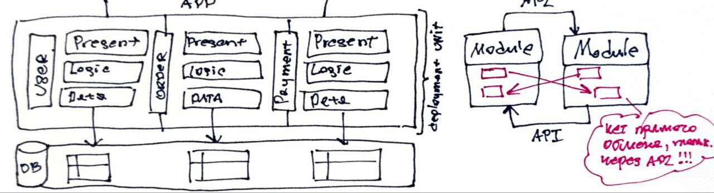

# Модульные монолиты

Модульные монолиты делят систему не по техническим аспектам, а по предметным.
Каждая предметная область соответствует модулю.

Развертывается как одно целое.

Переход от монолитный к модульно монолитной архитектуре.
- Заказ
  - представление
  - логика
  - данные
- Оплата
  - представление
  - логика
  - данные
- Клиент
  - представление
  - логика
  - данные

Модули взаимодействуют через интерфейсы модуля, скрывая реализацию.

Хотя БД одна для монолита, ее можно разделить на схемы для каждого модуля или просто условиться, 
какие таблицы принадлежат каким модулям.

Между модулями запрос на получение данных сущностей может происходить с указанием
идентификатора сущностей.

Преимущество
- разделение по предметным областям
- производительность
- кросс функциональные команды
- тестируемость отдельных модулей проще

Недостатки
- эксплуатация, эластичность, отказоустойчивость
- нужно следить за модульностью внимательно
- сложность повторого использования

Примеры применения модульного монолита
- онлайн аукцион, не подходит, нужна масштабируемость и эластичность
- финансовая система быстрых международных элекронных переводов, подходит
- компания, расширяющаяся, и постоянно меняющаяся, может быть и подойдет
- небольшая пекарня, принимающая заказы онлай, подходит
- система заявок на устранение неисправностей в электронике для
купивших платную поддержку, не подходит, требует эластичности и масштабируемости

