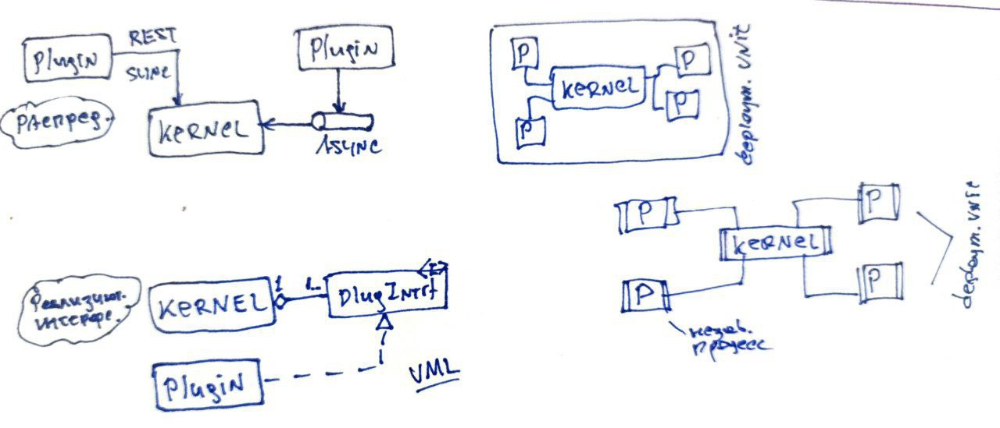

# Микроядерная архитектура

Микроядерная архитектура состоит из ядра и плагинов к нему.

Ядро
- редко меняется
- предоставляет минимальный набор возможностей
- мало полезно без плагинов

Плагины
- реализуют новые возможности
- работают независимо друг от друга
- развертываются независимо

Модель развертывания - монолитная. Но бывают и исключения.

Примеры
- браузер, может работать без плагинов, это не микроядро
- eclipse ide чистое микроядро

UI в монолитном микроядре может добавлятся прямо в ядро.

Плагины могут взаимодейтсвовать между собой, только осторожно!

Преимущества
- подгонка, настройка приложения
- адаптируемость, возможность изменять и добавлять новый функции
- развиваемость, когда старые функции недолго сохраняются

Недостатки
- стабильность ядра
- взаимодействие плагинов
- производительность при распределенном подходе

