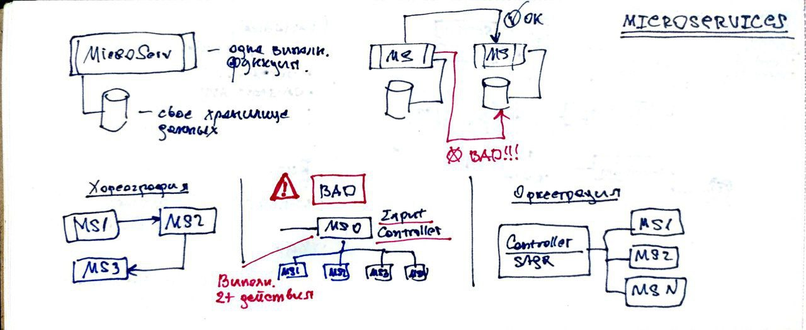

# Микросервисная архитектура



Приставка "микро" означает не физический размер сервиса, а его функциональность.
То есть он делает немного. Так же такой вид сервиса развертывается независимо.

Особенности
- выполняет только одну функцию
- имеет свое хранилище данных
- развертывается независимо

Определить, какую ОДНУ функцию должен выполнять микросервис - не просто.

Задача: измерять пульс и оповешать о его превышении.
Операции: чтение данных с датчика пульса, запись данных в хранилище, анализ данных и уведомление.
Какое решение выбрать:
1. все 4 операции реализовать в 1 микросервисе
2. чтение и запись это первый микросервис, анализ и оповещение второй
3. чтение, запись, анализ и оповещение - 4 разных микросервиса

## Размеры микросервисов

Маленькие микросервисы
- трудно поддерживать
- часто взаимодействуют по сети

Крупные микросервисы
- так же трудно поддерживать
- сложно тестировать
- сложно масштабировать

Причины уменьшения сервиса
- связность (вынесение слабосвязанных функций)
- отказоустойчивость
- изменчивость только части кода
- управлене доступом и безопасность
- разная масштабируемость для разных частей кода 

Причины укрупнения сервисов
- транзакционная целостность данных между сервисами
- координация рабочего процесса между несколькими сервисами
- сильная взаимосвязь данных между собой

Требуется равновесие между укрупняющими и уменьшающими факторами.
- что важнее масштабируемость или целостность данных?

```
Можно начать с большого сервиса и разделить его на части в будущем
```

## Общий функционал

Куда выносить общий функционал
- библиотека
- сервис

Сервис
- плюсы
  - изменение кода центрировано
  - выбор любой платформы реализации
- минусы
  - рискованные изменения
  - сетевые задержки
  - требуется высокая доступность
  - масштабирование вместе с клиентами

Библиотека
- плюсы
  - версионность библиотек
  - производительность, нет сетевых задержек
- минусы
  - единая платформа или дублирование логики на разных платформах
  - повторное развертывание всех сервисов при изменении библиотеки

## Управление рабочим процессом

Разбиение сервиса на микросервисы может потребовать координацы их для выполнения
запроса клиента. В то время как большой сервис все делает сам.

Управление раб. процессом
- оркестрация - централизованное
- хореография - децентрализованное 

Оркестратор - отдельный микросервис, отвечающий за выполнение раб. 
процесса (сценария использования или их группы). Скорее для сложных раб. процессов.
- плюсы
  - централизованно алгоритма
  - простота обработки ошибок
  - наглядность состояние раб. процесса
  - легкость внесения изменений в раб. процесс
- минусы
    - производительность, доп. сетевые взаимодействия
    - высокая связность оркестратора и его микросервисов
    - масштабируемость
    - доступность

Хореография скорее для простых раб. процессов
- плюсы
  - отзывчивость, нет нужды координации с "контроллером"
  - масштабируемость
  - слабя связанность
- минусы
  - обработка ошибок распределена
  - восстанавливаемость, сложно понять с какого места начать выполнять повторный запрос
  - управление и наблюдение состояние раб. процесса

## Возможности микросервисов

Сильные стороны
- удобство сопровождения микросервиса
- тестируемость проще
- развертываемость проще
- расширяемость (создаем новый сервис)
- масштабируемость
- отказоустойчивость

Слабые стороны
- сложность
- производительность, сетевое взаимодействие
- тех. сложность раб. процессов
- требуется кроссфункциональные команды разработки

## Причины деления на микросервисы большого сервиса (или проектирование с нуля)
- возможность использовать разные технологии
- кросс функциональные команды под каждый сервис
- производительность отдельного функционала в сервисе
- требования безопасности к части функцонала большого сервиса
- отказоустойчивость