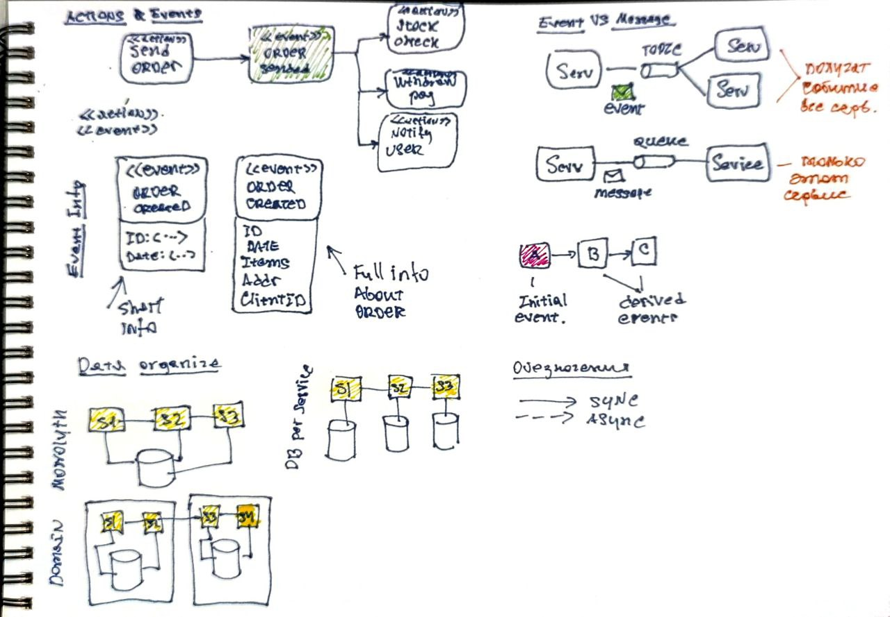

# Событийно управляемая архитектура



Событийно управляемая архитектура = Event Driven Architecture = EDA.

События порождаются действиями. А действия порождают события.

```
События != Сообщения
```

События 
- запустил и забыл
- сообщение о действии
- асинхронные
- оповещают, о том что УЖЕ ПРОИЗОШЛО
- пример
  - получен заказ
  - платеж отвергнут
  - заказ отправлен

Сообщения
- являются командой или запросом
- не всегда асинхронные
- требуют выполнения действия которое ЕЩЕ НЕ ПРОИЗОШЛО
- пример
  - принять оплату
  - отправить заказ
  - уведомить клиента

Типы событий
- инициирующее
- производные

Любое действие сервиса дложно порождать события. 
Даже такие события, на которые никто не подписан. Это нужно для 
расширяемости архитектуры и улучшению тестируемости.

Обработка ошибок в асинхронных сервисах может быть труднее, чем в синхронных.

## Хранение данных

Связность - насколько высока потребность во взаимодействии между сервисами.

Виды
- Монолитное - все данные в одной БД, севрисы работают с одной БД.
- Доменное - пачка сервисов, относящихся к одному домену имеют общую БД. Взаимодействие между доменами происходит через вызовы сервисов.
- БД на сервис - каждый сервис обладает своей БД.

| Характеристика                  | Монолитное | Доменное | БД на сервис |
|---------------------------------|------------|----------|--------------|
| **Связность**                   | Низкая     | Средняя  | Высокая      |
| **Производительность**          | Высокая    | Средняя  | Низкая       |
| **Простота реализации**         | Высокая    | Средняя  | Низкая       |
| **Простота внесения изменений** | Низкая     | Средняя  | Высокая      |
| **Отказоустойчивость**          | Низкая     | Средняя  | Высокая      |
| **Масштабируемость**            | Низкая     | Средняя  | Высокая      |


## Отличие микросервисов от EDA

| Характеристика               | Микросервисы              | EDA (Event-Driven Architecture) |
|------------------------------|---------------------------|---------------------------------|
| **Производительность**       | Низкая                    | Высокая                         |
| **Ограниченные контексты**   | Обязательные              | Не важны                        |
| **Владение данными**         | Единоличное (обязательно) | Не обязательно                  |
| **Специализация**            | Узкая                     | Может быть любой                |
| **Обработка входных данных** | По типу запросов          | По типу событий                 |
| **Связь между компонентами** | Синхронная                | Асинхронная                     |


## Событийно управляемые микросервисы

Это сочетание EDA и микросервисов.

## EDA особенности

Плюсы
- удобство сопровождения, слабая связанность
- высокая производительность, асинхронность
- развиваемость, расширяемость
- масштабируемость
- отказоустойчивость

Минусы
- сложность
- тестируемость
- асинхронность, если нужна синхронность
- возможно частичная высокая связанность из-за частого вызова сервисов друг друга

